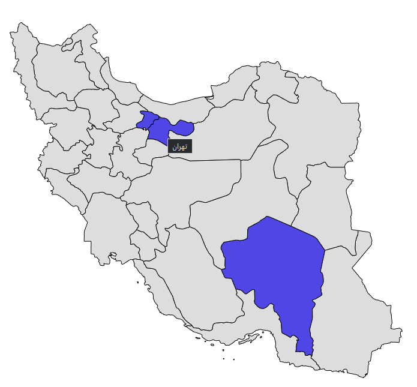

# iran-map-selector

a simple library for province select in Iran map.`React js`.

<div align="center">
  
</div>

## Installation

```code
npm install --save iran-map-selector
```

or

```code
yarn add iran-map-selector
```

## Usage

```javascript
import React from "react";
import MapSelector from "./package/MapSelector";

export default function Example() {
  return (
    <MapSelector
      hoverColor={"yellow"}
      onSelect={(selectedProvince) => {
        console.log(selectedProvince);
      }}
      containerClassName={"containerClassName"}
      selectedItems={["Tehran", "Kerman", "Alborz"]}
      selectedItemColor="yellow"
    />
  );
}
```

## Availble props

<table>
    <thead>
    <tr>
        <th>Name</th>
        <th style="text-align:center">Type</th>
        <th style="text-align:center">Default</th>
        <th>required</th>
    </tr>
    </thead>
    <tbody>
        <tr>
            <td>hoverColor</td>
            <td style="text-align:center">String (css color)</td>
            <td style="text-align:center">#4F46E5</td>
            <td>false</td>
        </tr>
                <tr>
            <td>onSelect</td>
            <td style="text-align:center">Function</td>
            <td style="text-align:center">alert(result)</td>
            <td>false</td>
        </tr>
        <tr>
            <td>containerClassName</td>
            <td style="text-align:center">String</td>
            <td style="text-align:center">null</td>
            <td>false</td>
        </tr>
        <tr>
            <td>selectedItems</td>
            <td style="text-align:center">
                Array(string) 
                <br/> 
                <a target="_blank" href="./provinces_list.md">Provinces list</a></td>
            <td style="text-align:center">null</td>
            <td>false</td>
        </tr>
          <tr>
            <td>selectedItemColor</td>
            <td style="text-align:center">String (css color)</td>
            <td style="text-align:center">#4F46E5</td>
            <td>false</td>
        </tr>
    </tbody>
</table>
